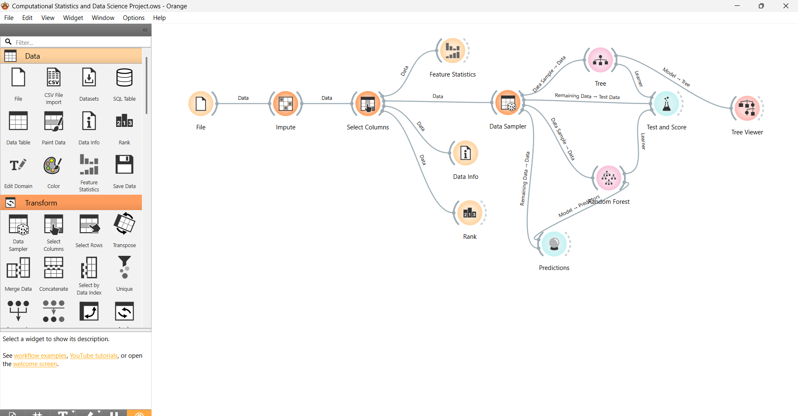

# Student Performance Prediction

## Overview

This project predicts student performance using machine learning techniques in Orange Data Mining. A Random Forest model is used to analyze factors affecting student performance.

## Tools Used

* Orange Data Mining
* Random Forest Algorithm

## Dataset

* File: student_data.csv
* Contains features related to student performance

## Project Workflow

* Data input and preprocessing
* Feature selection
* Model training using Random Forest
* Evaluation of model performance

## Screenshots

### Workflow


## Project Structure

```
student-performance-prediction/
│── workflow.ows
│── dataset/
│   └── student_data.csv
│── README.md
```

## How to Run

1. Open Orange Data Mining
2. Load the `workflow.ows` file
3. Run the workflow

## Key Outcome

* Built a predictive model for student performance
* Identified key factors affecting performance
